 
## 查看主页获取源码

> **作者介绍**： **✌**全网粉丝10W+本平台特邀作者、博客专家、CSDN新星计划导师、java领域优质创作者,博客之星、掘金/华为云/阿里云/InfoQ等平台优质作者、专注于项目实战 **✌**

  

### 一、作品包含

源码+数据库+设计文档万字+PPT+全套环境和工具资源+部署教程

### 二、项目技术

前端技术：Html、Css、Js、Vue、Element-ui

数据库：MySQL

后端技术：Java、Spring Boot、MyBatis

  

### 三、运行环境

开发工具：IDEA/eclipse

数据库：MySQL5.7

数据库管理工具：Navicat10以上版本

环境配置软件： JDK1.8+Maven3.6.3

前端Nodejs：14

### 四、项目介绍
项目编号：springbootA129

在这个充满二次元魅力的时代，动漫周边商城管理系统应运而生，系统化管理确保了商城的高效运营，为我国动漫产业的繁荣发展注入新的活力。

前台用户功能：浏览首页、文章资讯、动漫活动、动漫商品、后台管理、购物车和个人中心。

后台分为管理员和用户
管理员的功能：系统首页、个人中心、用户管理、文章资讯管理、文章类型管理、动漫活动管理、动漫商品管理、商品类型管理、系统管理、订单管理。
用户的功能：系统首页、个人中心、文章资讯管理。

### 五、运行截图

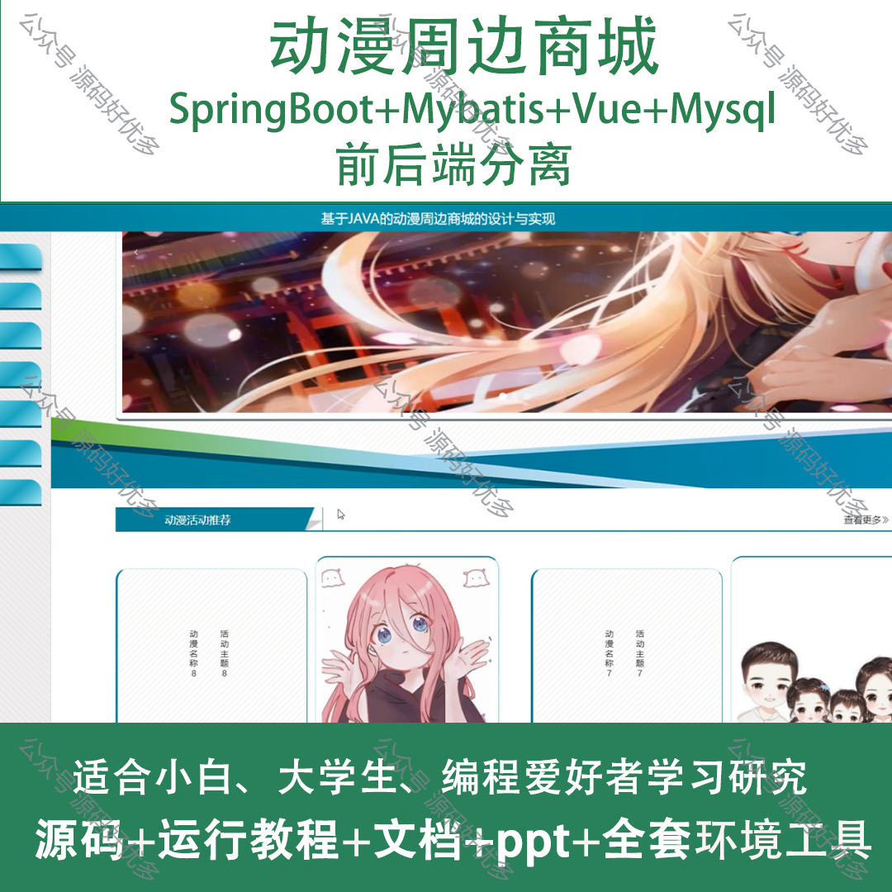
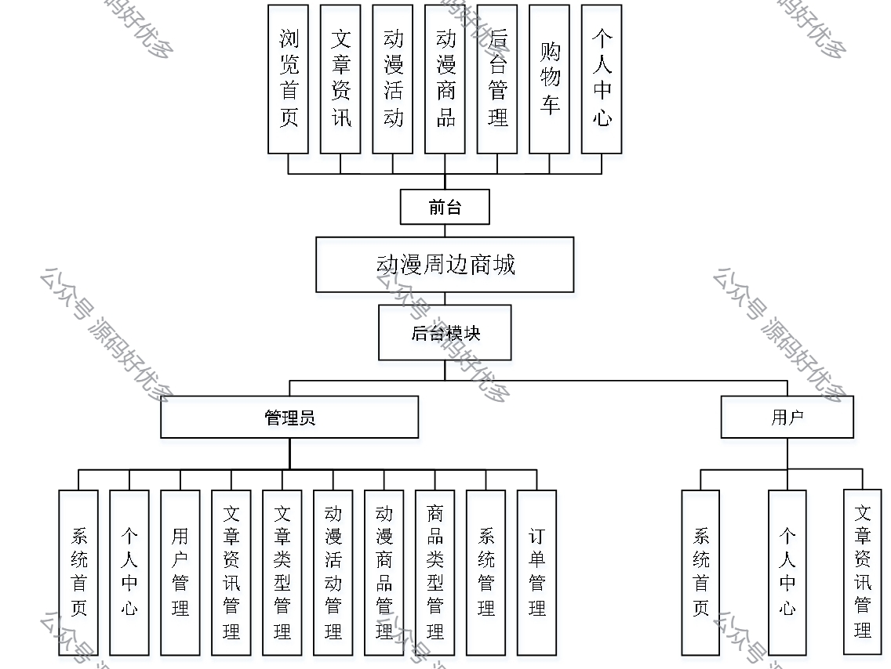
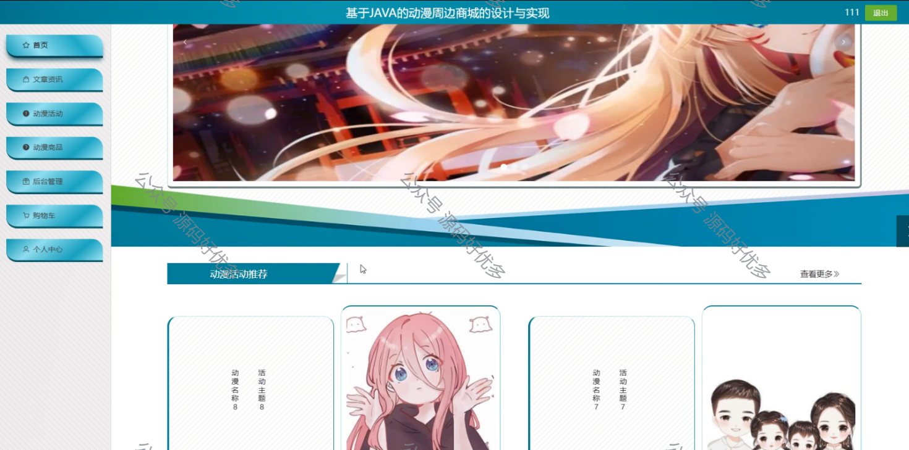
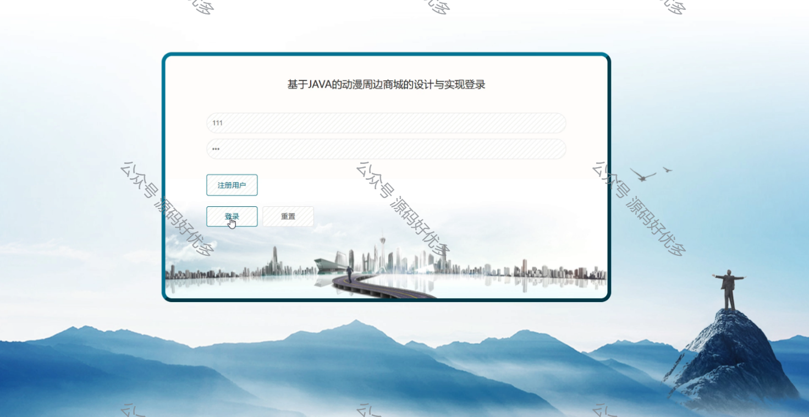
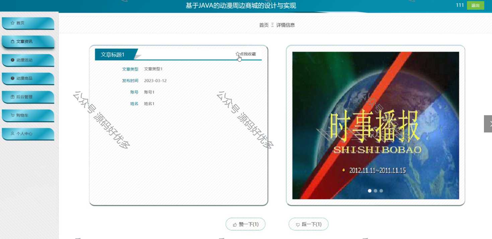
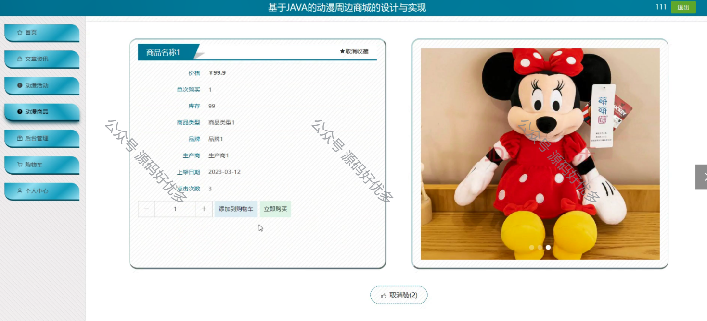
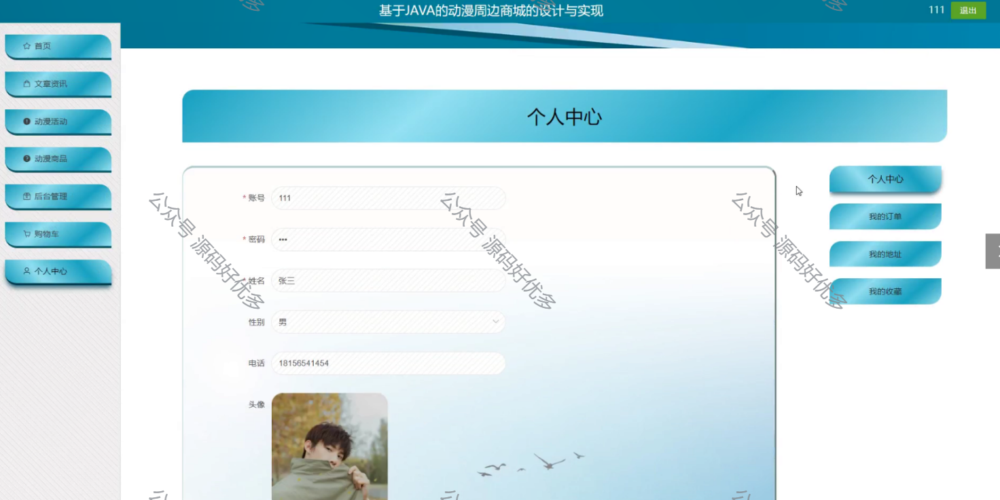
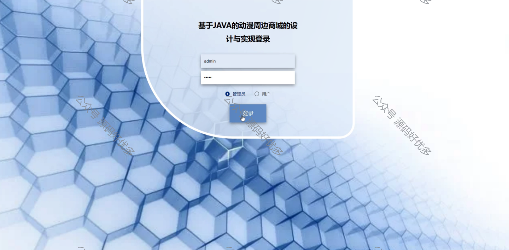
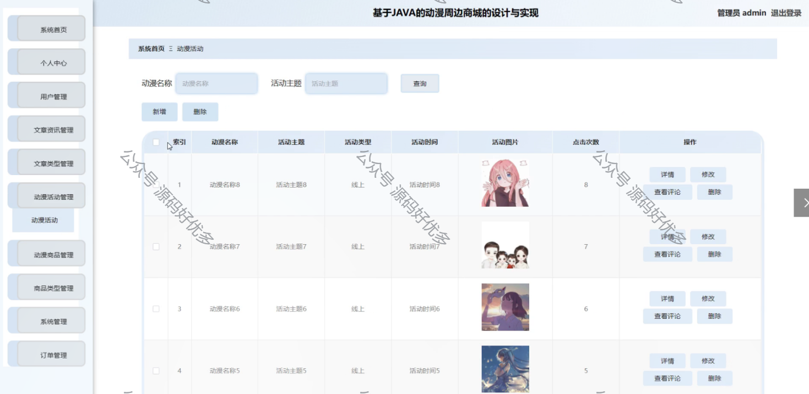
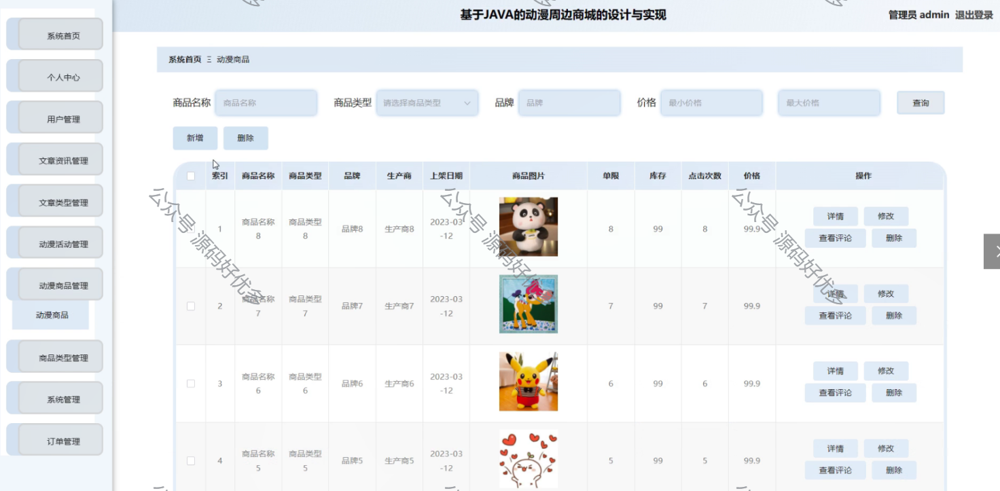
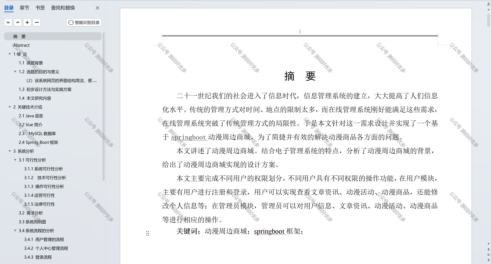

  
